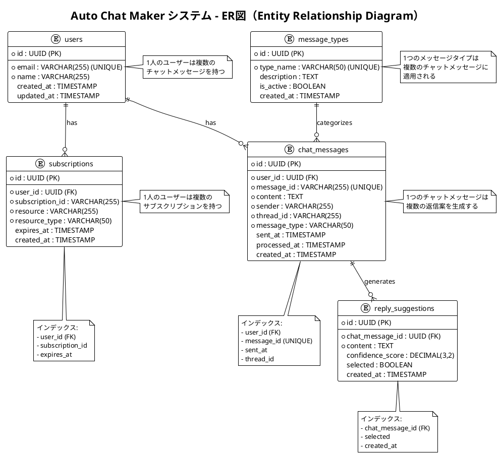

# ER図

Auto Chat MakerシステムのER図（Entity Relationship Diagram）です。

## 概要

この図は、Auto Chat Makerシステムのデータベース設計を示しています。主要なエンティティとその関係性を表現しています。

## ER図

## 説明

### エンティティ

1. **users（ユーザー）**
   - システムの利用者情報
   - メールアドレスと名前を管理

2. **message_types（メッセージタイプ）**
   - チャットメッセージの分類
   - システムで処理するメッセージの種類を定義

3. **chat_messages（チャットメッセージ）**
   - Teamsチャットのメッセージ情報
   - 送信者、内容、スレッド情報を管理

4. **reply_suggestions（返信案）**
   - AIが生成した返信案
   - 信頼度スコアと選択状態を管理

5. **subscriptions（サブスクリプション）**
   - Microsoft Graph APIのサブスクリプション情報
   - Webhook通知の管理

### リレーションシップ

- **users** → **chat_messages**: 1対多（1人のユーザーは複数のチャットメッセージを持つ）
- **users** → **subscriptions**: 1対多（1人のユーザーは複数のサブスクリプションを持つ）
- **message_types** → **chat_messages**: 1対多（1つのメッセージタイプは複数のチャットメッセージに適用される）
- **chat_messages** → **reply_suggestions**: 1対多（1つのチャットメッセージは複数の返信案を生成する）

### インデックス

各テーブルには適切なインデックスが設定されており、クエリパフォーマンスを最適化しています。

## PlantUMLソースコード

