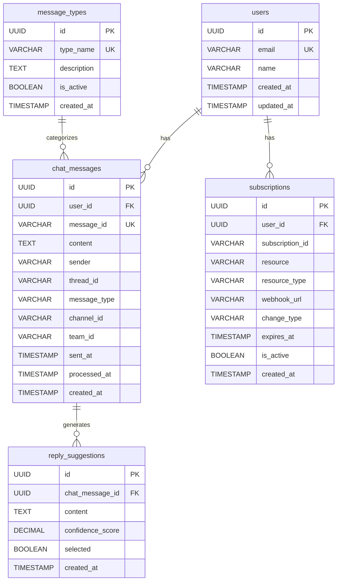

# ER図

Auto Chat MakerシステムのER図（Entity Relationship Diagram）です。

## 概要

この図は、Auto Chat Makerシステムのデータベース設計を示しています。主要なエンティティとその関係性を表現しています。

## ER図

## 説明

### エンティティ

1. **users（ユーザー）**
   - システムの利用者情報
   - メールアドレスと名前を管理

2. **message_types（メッセージタイプ）**
   - チャットメッセージの分類
   - システムで処理するメッセージの種類を定義

3. **chat_messages（チャットメッセージ）**
   - Teamsチャットのメッセージ情報
   - 送信者、内容、スレッド情報、チャンネルID、チームIDを管理

4. **reply_suggestions（返信案）**
   - AIが生成した返信案
   - 信頼度スコアと選択状態を管理

5. **subscriptions（サブスクリプション）**
   - Microsoft Graph APIのサブスクリプション情報
   - Webhook通知の管理

### リレーションシップ

- **users** → **chat_messages**: 1対多（1人のユーザーは複数のチャットメッセージを持つ）
- **users** → **subscriptions**: 1対多（1人のユーザーは複数のサブスクリプションを持つ）
- **message_types** → **chat_messages**: 1対多（1つのメッセージタイプは複数のチャットメッセージに適用される）
- **chat_messages** → **reply_suggestions**: 1対多（1つのチャットメッセージは複数の返信案を生成する）

### インデックス

各テーブルには適切なインデックスが設定されており、クエリパフォーマンスを最適化しています。

#### chat_messages テーブル
- `user_id` (FK)
- `message_id` (UNIQUE)
- `sent_at`
- `thread_id`
- `channel_id`
- `team_id`
- `processed_at`

#### reply_suggestions テーブル
- `chat_message_id` (FK)
- `selected`
- `created_at`
- `confidence_score`

#### subscriptions テーブル
- `user_id` (FK)
- `subscription_id`
- `expires_at`
- `resource_type`
- `is_active`

### データ型の説明

- **UUID**: 一意識別子（Primary Key、Foreign Key）
- **VARCHAR**: 可変長文字列
- **TEXT**: 長文テキスト
- **DECIMAL**: 小数点付き数値
- **BOOLEAN**: 真偽値
- **TIMESTAMP**: 日時情報

### 外部キー制約

- `chat_messages.user_id` → `users.id`
- `reply_suggestions.chat_message_id` → `chat_messages.id`
- `subscriptions.user_id` → `users.id`

### 一意制約

- `users.email`: メールアドレスの重複禁止
- `chat_messages.message_id`: TeamsメッセージIDの重複禁止
- `message_types.type_name`: メッセージタイプ名の重複禁止

詳細な開発ルールについては [開発者ガイド](../developer-guide/README.md) を参照してください。

## 更新履歴

- 初版作成: 2024年12月
- データベーススキーマとの整合性確保: 2024年12月 - channel_id、team_idカラムを追加、subscriptionsテーブルの詳細化
- 最終更新: 2024年12月
- 更新者: 開発チーム
