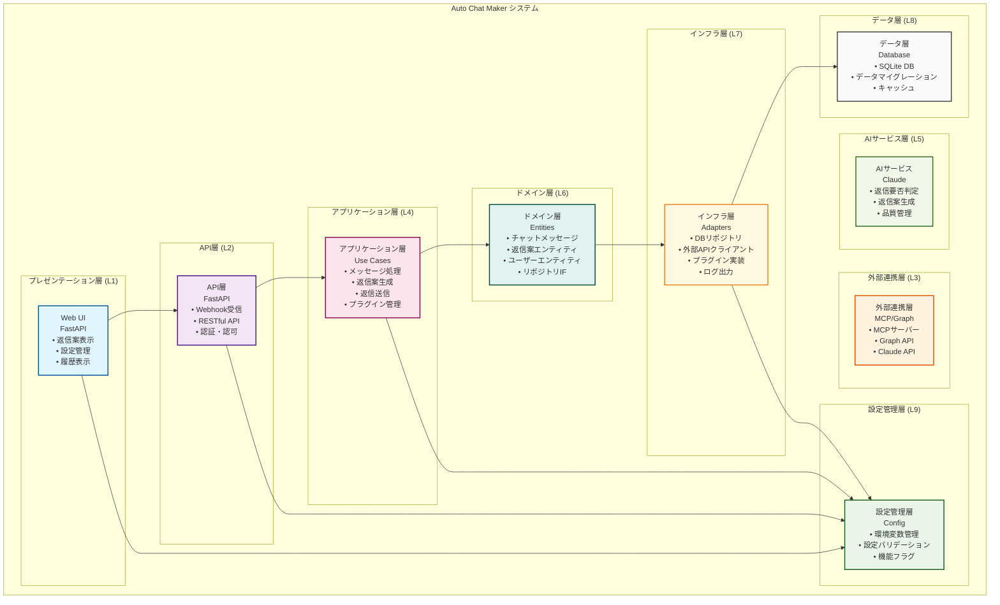
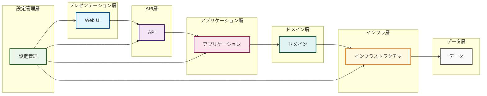
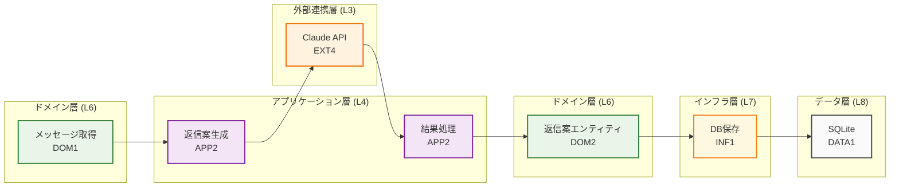
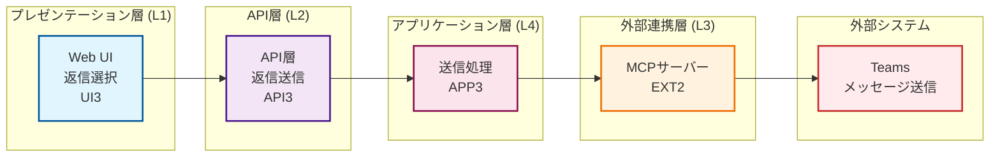
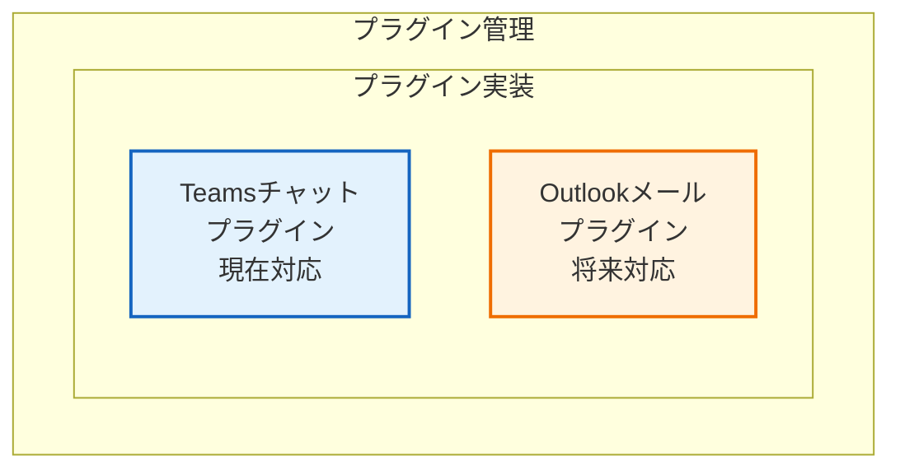
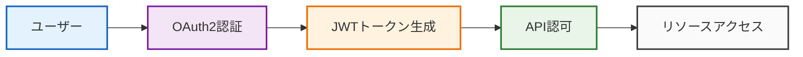

# システム全体構造設計書

## 概要

Auto Chat Makerシステムの全体構造とコンポーネント間の関係性を定義します。クリーンアーキテクチャに基づくシステム構成と、各コンポーネントの役割・関係性を明確にします。

## システム全体構成図

### システム境界とコンポーネント配置



## コンポーネント詳細

### 層概要表

| ID | 層名 | 責任 | 主要機能 |
|---|---|---|---|
| L1 | Web UI層 | ユーザーインターフェースの提供 | 返信案表示、設定管理、履歴表示 |
| L2 | API層 | HTTPリクエストの受信・処理・レスポンス | Webhook受信、RESTful API、認証・認可 |
| L3 | 外部連携層 | 外部システムとの連携 | MCPサーバー連携、Microsoft Graph API、Claude API |
| L4 | アプリケーション層 | ビジネスプロセスの調整 | メッセージ処理、返信案生成、返信送信 |
| L5 | AIサービス層 | AI機能の提供 | 返信要否判定、返信案生成、品質管理 |
| L6 | ドメイン層 | ビジネスルールとエンティティ | エンティティ管理、リポジトリ抽象化 |
| L7 | インフラストラクチャ層 | 外部システムとの連携実装 | データベース、外部API、プラグイン |
| L8 | データ層 | データの永続化 | SQLite、マイグレーション、キャッシュ |
| L9 | 設定管理層 | アプリケーション設定の管理 | 環境変数、設定バリデーション、機能フラグ |

### 1. Web UI層
**責任**: ユーザーインターフェースの提供

#### **Web UI層詳細表**

| ID | 対応層ID | コンポーネント | 機能 | 主要操作 | 対応機能要件ID |
|---|---|---|---|---|---|
| UI1 | L1 | 返信案表示UI | 返信案の一覧表示 | 生成された返信案の表示・選択 | R-004 |
| UI2 | L1 | 返信案表示UI | 返信案の選択・編集 | 返信案の選択・編集 | R-004 |
| UI3 | L1 | 返信案表示UI | 送信実行 | 選択した返信案の送信実行 | R-004, R-005 |
| UI4 | L1 | 設定管理UI | 設定変更 | システム設定の変更・確認 | R-006 |
| UI5 | L1 | 設定管理UI | 設定確認 | 現在の設定内容の確認 | R-006 |
| UI6 | L1 | 履歴表示UI | 履歴確認 | 処理済みメッセージの履歴表示 | R-004 |

### 2. API層
**責任**: HTTPリクエストの受信・処理・レスポンス

#### **API層詳細表**

| ID | 対応層ID | コンポーネント | 機能 | エンドポイント | 対応機能要件ID |
|---|---|---|---|---|---|
| API1 | L2 | Webhook受信 | Microsoft Graph Webhookの受信 | `POST /api/webhook/microsoft-graph` | R-001 |
| API2 | L2 | RESTful API | メッセージ一覧取得 | `GET /api/chat-messages` | R-004 |
| API3 | L2 | RESTful API | 返信送信 | `POST /api/chat-messages/{id}/reply` | R-005 |
| API4 | L2 | 認証・認可 | OAuth2認証・JWT認可 | - | R-006 |
| API5 | L2 | バリデーション | リクエスト・レスポンスの検証 | - | R-006 |

### 3. 外部連携層
**責任**: 外部システムとの連携

#### **外部連携層詳細表**

| ID | 対応層ID | コンポーネント | 機能 | 主要機能 | 対応機能要件ID |
|---|---|---|---|---|---|
| EXT1 | L3 | MCPサーバー連携 | Teamsチャットメッセージ取得 | Teamsチャットメッセージ取得 | R-002 |
| EXT2 | L3 | MCPサーバー連携 | Teamsチャット返信送信 | Teamsチャット返信送信 | R-005 |
| EXT3 | L3 | Microsoft Graph API | Webhookサブスクリプション管理 | Webhook管理・メタデータ取得 | R-001 |
| EXT4 | L3 | Claude API | AI判定・生成 | AI判定・生成 | R-003 |

### 4. アプリケーション層
**責任**: ビジネスプロセスの調整

#### **アプリケーション層詳細表**

| ID | 対応層ID | コンポーネント | 機能 | 主要フロー | 対応機能要件ID |
|---|---|---|---|---|---|
| APP1 | L4 | メッセージ処理ユースケース | チャットメッセージの処理フロー | Webhook受信 → メッセージ処理 | R-001, R-002 |
| APP2 | L4 | 返信案生成ユースケース | AIによる返信案生成 | AI判定 → 返信案生成 | R-003 |
| APP3 | L4 | 返信送信ユースケース | 選択された返信の送信 | ユーザー選択 → 返信送信 | R-005 |
| APP4 | L4 | プラグイン管理 | メッセージ処理プラグインの管理 | プラグイン管理 | R-006 |

### 5. ドメイン層
**責任**: ビジネスルールとエンティティ

#### **ドメイン層詳細表**

| ID | 対応層ID | コンポーネント | 機能 | 主要エンティティ | 対応機能要件ID |
|---|---|---|---|---|---|
| DOM1 | L6 | チャットメッセージエンティティ | メッセージの基本情報 | `ChatMessage`: メッセージID、内容、送信者、送信日時 | R-001, R-002 |
| DOM2 | L6 | 返信案エンティティ | AI生成返信案 | `ReplySuggestion`: 返信案ID、内容、信頼度、選択状態 | R-003, R-004 |
| DOM3 | L6 | ユーザーエンティティ | ユーザー情報 | `User`: ユーザーID、メール、名前 | R-004, R-006 |
| DOM4 | L6 | リポジトリインターフェース | データアクセスの抽象化 | - | R-006 |

### 6. インフラストラクチャ層
**責任**: 外部システムとの連携実装

#### **インフラストラクチャ層詳細表**

| ID | 対応層ID | コンポーネント | 機能 | 主要実装 | 対応機能要件ID |
|---|---|---|---|---|---|
| INF1 | L7 | データベースリポジトリ | SQLAlchemy実装 | SQLAlchemy ORM | R-001, R-002, R-003, R-004, R-005 |
| INF2 | L7 | 外部APIクライアント | HTTP通信実装 | httpx HTTPクライアント | R-001, R-002, R-003, R-005 |
| INF3 | L7 | プラグイン実装 | Teamsチャット処理プラグイン | Teamsチャットプラグイン | R-002, R-005, R-006 |
| INF4 | L7 | ログ出力 | structlog実装 | 構造化ログ出力 | R-006 |

### 7. データ層
**責任**: データの永続化

#### **データ層詳細表**

| ID | 対応層ID | コンポーネント | 機能 | 主要テーブル | 対応機能要件ID |
|---|---|---|---|---|---|
| DATA1 | L8 | SQLiteデータベース | ローカルファイルベースDB | users, chat_messages, reply_suggestions, subscriptions | R-001, R-002, R-003, R-004, R-005 |
| DATA2 | L8 | データマイグレーション | Alembic | データベースマイグレーション | R-006 |
| DATA3 | L8 | キャッシュ | メモリキャッシュ | キャッシュ機能 | R-006 |

### 8. 設定管理層
**責任**: アプリケーション設定の管理

#### **設定管理層詳細表**

| ID | 対応層ID | コンポーネント | 機能 | 主要設定 | 対応機能要件ID |
|---|---|---|---|---|---|
| CONFIG1 | L9 | 環境変数管理 | .envファイル読み込み | データベース接続情報、外部API認証情報 | R-001, R-002, R-003, R-005, R-006 |
| CONFIG2 | L9 | 設定バリデーション | Pydantic Settings | 設定バリデーション | R-006 |
| CONFIG3 | L9 | 機能フラグ | 機能の有効/無効制御 | 機能フラグ設定、ログレベル設定 | R-006 |

### 9. AIサービス層
**責任**: AI機能の提供

#### **AIサービス層詳細表**

| ID | 対応層ID | コンポーネント | 機能 | 主要機能 | 対応機能要件ID |
|---|---|---|---|---|---|
| AI1 | L5 | 返信要否判定 | メッセージに対する返信の必要性判定 | 返信要否判定 | R-003 |
| AI2 | L5 | 返信案生成 | AIによる返信案の生成 | 返信案生成 | R-003 |
| AI3 | L5 | 品質管理 | 生成された返信案の品質管理 | 品質管理 | R-003 |

## コンポーネント間の関係性

### 依存関係の方向



### データフロー詳細

#### 1. Webhook受信フロー

```mermaid
flowchart LR
    subgraph "外部システム"
        Graph[Microsoft Graph]
    end

    subgraph "API層 (L2)"
        Webhook[Webhook受信<br/>API1]
    end

    subgraph "アプリケーション層 (L4)"
        Processor[メッセージ処理<br/>APP1]
    end

    subgraph "ドメイン層 (L6)"
        Entity[エンティティ作成<br/>DOM1]
    end

    subgraph "インフラ層 (L7)"
        DB[DB保存<br/>INF1]
    end

    subgraph "データ層 (L8)"
        SQLite[SQLite<br/>DATA1]
    end

    Graph --> Webhook
    Webhook --> Processor
    Processor --> Entity
    Entity --> DB
    DB --> SQLite

    %% スタイル定義
    classDef externalSystem fill:#ffebee,stroke:#c62828,stroke-width:2px
    classDef apiLayer fill:#e3f2fd,stroke:#1565c0,stroke-width:2px
    classDef appLayer fill:#f3e5f5,stroke:#7b1fa2,stroke-width:2px
    classDef domainLayer fill:#e8f5e8,stroke:#2e7d32,stroke-width:2px
    classDef infraLayer fill:#fff3e0,stroke:#ef6c00,stroke-width:2px
    classDef dataLayer fill:#fafafa,stroke:#424242,stroke-width:2px

    class Graph externalSystem
    class Webhook apiLayer
    class Processor appLayer
    class Entity domainLayer
    class DB infraLayer
    class SQLite dataLayer
```



#### 2. 返信案生成フロー



#### 3. 返信送信フロー



## プラグインアーキテクチャ

### プラグイン構造



### プラグインインターフェース
```python
class MessageProcessor(ABC):
    @abstractmethod
    def process_message(self, message: Dict[str, Any]) -> Dict[str, Any]:
        """メッセージを処理する"""
        pass

    @abstractmethod
    def send_reply(self, message_id: str, content: str) -> bool:
        """返信を送信する"""
        pass

    @abstractmethod
    def get_message_type(self) -> str:
        """メッセージタイプを取得する"""
        pass
```

## セキュリティアーキテクチャ

### 認証・認可フロー


### データ保護
- **通信暗号化**: TLS 1.3
- **データベース暗号化**: SQLite暗号化拡張
- **機密情報**: 環境変数による管理
- **アクセス制御**: ロールベースアクセス制御

## パフォーマンス設計

### 非同期処理
- **FastAPI非同期**: 同時リクエスト処理
- **データベース接続**: 接続プール
- **キャッシュ**: メモリキャッシュ

### スケーラビリティ
- **水平スケーリング**: 複数インスタンス対応
- **垂直スケーリング**: リソース増強対応
- **データベース**: 読み取り専用レプリカ対応

## 監視・ログ設計

### ログ構造
```
アプリケーション層 → structlog → 構造化ログ → ファイル出力
```

### メトリクス
- **API応答時間**: 各エンドポイントの性能
- **エラー率**: システム安定性
- **処理件数**: システム稼働状況
- **外部API呼び出し**: 外部サービス依存度

## 更新履歴

- 初版作成: 2024年12月
- システム全体構造設計: 2024年12月 - コンポーネント間関係性を明確化
- 機能要件対応関係追加: 2024年12月 - 各層の機能と機能要件IDの対応関係を追加
- 最終更新: 2024年12月
- 更新者: 開発チーム
