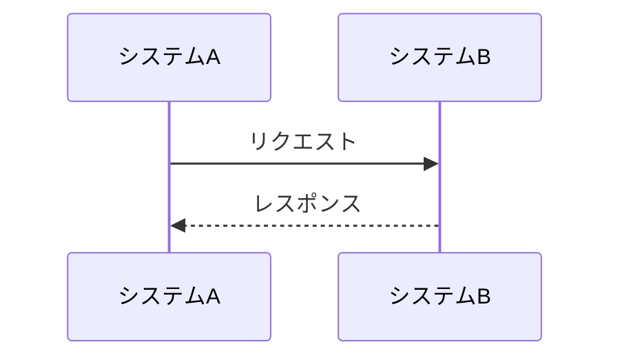

# 開発者ガイド

このディレクトリには、開発者向けのガイドラインが含まれています。

## コミットメッセージのルール

### 基本フォーマット

```
[コミット種別]要約

変更した理由（内容、詳細）
```

### コミット種別

以下の種別から適切なものを選択してください：

- **fix**: バグ修正
- **hotfix**: クリティカルなバグ修正
- **add**: 新規（ファイル）機能追加
- **update**: 機能修正（バグではない）
- **change**: 仕様変更
- **clean**: 整理（リファクタリング等）
- **disable**: 無効化（コメントアウト等）
- **remove**: 削除（ファイル）
- **upgrade**: バージョンアップ
- **revert**: 変更取り消し

### ライト版（推奨）

シンプルに以下の4つを使用：

- **fix**: バグ修正
- **add**: 新規（ファイル）機能追加
- **update**: 機能修正（バグではない）
- **remove**: 削除（ファイル）

### 要約の書き方

変更内容の概要をシンプルかつ分かりやすく記載してください。

**良い例：**
- `[fix]削除フラグが更新されない不具合の修正`
- `[add]ユーザー認証機能の追加`
- `[update]ログ出力の改善`

**悪い例：**
- `修正`
- `バグ修正`
- `機能追加`

### 詳細説明

変更した理由を具体的に記載してください。チケット管理システムを使用している場合は、チケット番号も含めてください。

**例：**
```
[fix]削除フラグが更新されない不具合の修正

refs #110 更新SQLの対象カラムに削除フラグが含まれていなかったため追加しました。
```

### コミット単位について

コミットはできる限り細かい粒度で行ってください。複数のバグ修正を1つのコミットにまとめることは避けてください。

**良い例：**
- 1つのバグ修正 = 1つのコミット
- 1つの機能追加 = 1つのコミット

**悪い例：**
- 複数のバグ修正を1つのコミットにまとめる
- 機能追加とバグ修正を1つのコミットにまとめる

## 図表作成ルール

### PlantUML使用禁止

**重要**: 機密性の観点から、PlantUMLの使用は禁止されています。

#### 禁止理由
1. **機密性の問題**: PlantUMLは外部サーバーに図表データを送信するため、機密情報が漏洩するリスクがあります
2. **依存性の問題**: 外部サービスに依存することで、サービス停止時に図表が表示されなくなります
3. **オフライン対応**: 外部サービスにアクセスできない環境では図表が表示されません

### Mermaid推奨

すべての図表は**Mermaid形式**で作成してください。

#### 推奨理由
1. **機密性の確保**: 図表データが外部に送信されることがありません
2. **ネイティブサポート**: GitHub、GitLab、MkDocsなど多くのプラットフォームでネイティブにサポートされています
3. **オフライン対応**: 外部サービスに依存せず、ローカル環境でも図表を表示できます
4. **バージョン管理**: 図表のソースコードをGitで管理できます

### 対応図表形式

#### 対応可能な図表
- **シーケンス図**: `sequenceDiagram`
- **フローチャート**: `flowchart`
- **ER図**: `erDiagram`
- **クラス図**: `classDiagram`
- **ユースケース図**: `graph`（フローチャート形式で表現）
- **ガントチャート**: `gantt`
- **状態図**: `stateDiagram`

#### 使用例



### 図表作成時のルール

1. **PlantUML禁止**: 機密性の観点からPlantUMLの使用は禁止
2. **Mermaid推奨**: すべての図表はMermaid形式で作成
3. **バージョン管理**: 図表のソースコードもGitで管理
4. **ドキュメント化**: 図表の説明と参加者の詳細を必ず記載

### ファイル命名規則

- 図表ファイル: `{図表名}-diagram.md`
- 例: `sequence-diagram.md`, `er-diagram.md`, `use-case-diagram.md`

### ドキュメント構造

```markdown
# 図表タイトル

## 概要
図表の概要説明

## 開発ルール
**重要**: 機密性の観点から、PlantUMLの使用は禁止されています。すべての図表はMermaid形式で作成してください。

## 図表
```mermaid
// Mermaidコード
```

## 説明
図表の詳細説明

## 技術仕様
### 使用技術
- **図表形式**: Mermaid（機密性確保のためPlantUMLは使用禁止）
- **対応環境**: GitHub、GitLab、MkDocs、その他Mermaid対応プラットフォーム
- **バージョン**: Mermaid 10.x以上

### 開発ルール
1. **PlantUML禁止**: 機密性の観点からPlantUMLの使用は禁止
2. **Mermaid推奨**: すべての図表はMermaid形式で作成
3. **バージョン管理**: 図表のソースコードもGitで管理
4. **ドキュメント化**: 図表の説明と参加者の詳細を必ず記載
```

### 既存ファイルの対応

#### 変換済みファイル
- ✅ `docs/requirements/sequence-diagram.md` - シーケンス図
- ✅ `docs/requirements/use-case-diagram.md` - ユースケース図
- ✅ `docs/design/er-diagram.md` - ER図

#### 今後の対応
- 新規作成する図表はすべてMermaid形式で作成
- 既存のPlantUMLファイルがある場合はMermaidに変換

### 技術仕様

#### Mermaid対応環境
- **GitHub**: ネイティブサポート
- **GitLab**: ネイティブサポート
- **MkDocs**: Material for MkDocsプラグインで対応
- **VS Code**: Mermaid拡張機能で対応
- **その他**: 多くのMarkdownエディタで対応

#### 推奨バージョン
- **Mermaid**: 10.x以上
- **Material for MkDocs**: 9.x以上（Mermaidサポート）

## 参考資料

- [Gitのコミットメッセージの書き方](https://qiita.com/itosho/items/9565c6ad2ffc24c09364)

## 更新履歴

- 初版作成: 2024年12月
- 図表作成ルール追加: 2024年12月 - 機密性確保のためPlantUML使用禁止とMermaid推奨ルールを追加
- 既存ファイル変換完了: 2024年12月 - シーケンス図、ユースケース図、ER図をMermaidに変換
- 最終更新: 2024年12月
- 更新者: 開発チーム
