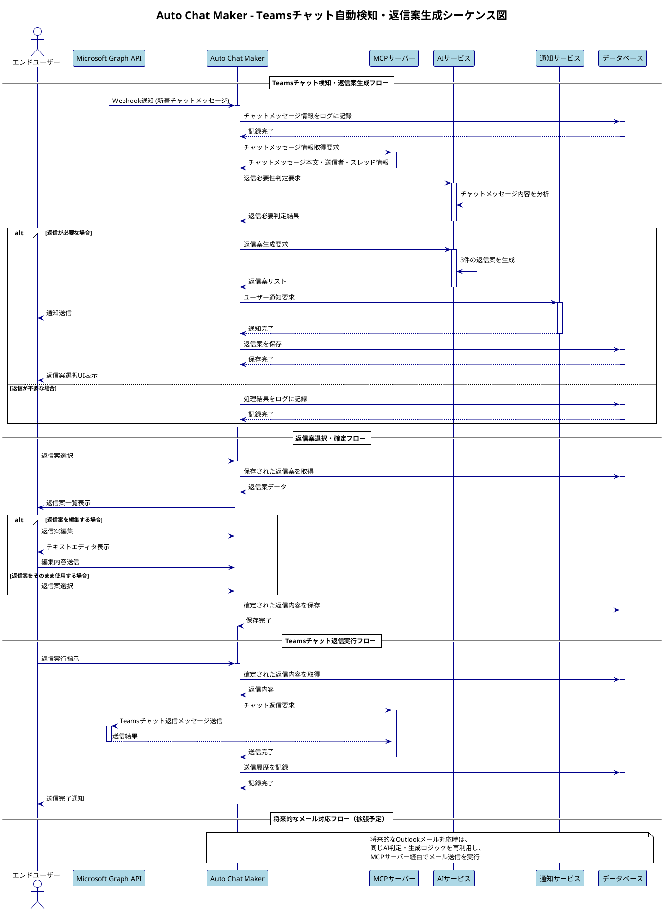

# シーケンス図

Auto Chat Makerシステムのシーケンス図です。

## 概要

この図は、Auto Chat Makerシステムの主要な処理フローの時系列での動作を示しています。

## シーケンス図

## 説明

### 主要フロー

1. **Teamsチャット検知・返信案生成フロー**
   - Microsoft Graph APIからのWebhook通知を受信
   - チャットメッセージ情報を取得・記録
   - AIサービスによる返信必要性判定
   - 返信が必要な場合、返信案を生成・通知

2. **返信案選択・確定フロー**
   - ユーザーによる返信案の選択・編集
   - 確定された返信内容の保存

3. **Teamsチャット返信実行フロー**
   - MCPサーバー経由でのTeamsチャット返信
   - 送信履歴の記録

### 参加者

- **エンドユーザー**: システムの利用者
- **Microsoft Graph API**: Teamsチャットとの連携
- **Auto Chat Maker**: メインシステム
- **MCPサーバー**: チャット送信の実行
- **AIサービス**: 返信判定・生成
- **通知サービス**: ユーザー通知
- **データベース**: データ保存・管理

### 拡張予定

将来的なOutlookメール対応では、同じAI判定・生成ロジックを再利用し、MCPサーバー経由でメール送信を実行する予定です。

## PlantUMLソースコード

