# ユースケース図

Auto Chat Makerシステムのユースケース図です。

## 概要

この図は、Auto Chat Makerシステムの主要な機能とアクターの関係を示しています。

## ユースケース図

## 説明

### アクター

- **エンドユーザー**: システムの主要利用者
- **システム管理者**: システム設定の管理者
- **Microsoft Graph API**: Teamsチャットとの連携
- **MCPサーバー**: チャット送信の実行
- **AIサービス**: 返信案生成と学習
- **通知サービス**: ユーザーへの通知

### 主要ユースケース

1. **Teamsチャット自動検知・返信案生成**: 新着メッセージの自動検知とAIによる返信案生成
2. **返信案選択・確定**: ユーザーによる返信案の選択と編集
3. **Teamsチャット返信実行**: 確定された返信の送信
4. **システム設定管理**: 管理者によるシステム設定の管理

### 拡張ユースケース

- **返信パターン学習**: AIによる返信パターンの学習
- **バッチ処理**: 定期的な処理の実行
- **将来的なメール対応**: Outlookメール対応（拡張予定）

## PlantUMLソースコード

```plantuml
@startuml Auto Chat Maker Use Case Diagram

!theme plain
skinparam actorStyle awesome
skinparam usecase {
    BackgroundColor LightBlue
    BorderColor DarkBlue
}

title Auto Chat Maker システム - ユースケース図（Teamsチャット対応）

' アクター定義
actor "エンドユーザー" as User
actor "システム管理者" as Admin
actor "Microsoft Graph API" as GraphAPI
actor "MCPサーバー" as MCPServer
actor "AIサービス" as AIService
actor "通知サービス" as NotificationService

' システム境界
rectangle "Auto Chat Maker システム" {

    ' 主要ユースケース
    usecase "Teamsチャット自動検知・返信案生成" as UC1
    usecase "返信案選択・確定" as UC2
    usecase "Teamsチャット返信実行" as UC3
    usecase "システム設定管理" as UC4

    ' 拡張ユースケース
    usecase "返信パターン学習" as UC5
    usecase "バッチ処理" as UC6
    usecase "将来的なメール対応" as UC7

    ' 包含ユースケース
    usecase "チャットメッセージ情報取得" as UC8
    usecase "返信必要性判定" as UC9
    usecase "返信案生成" as UC10
    usecase "ユーザー通知" as UC11
    usecase "送信結果確認" as UC12
    usecase "処理ログ記録" as UC13
}

' 関係性定義
User --> UC1
User --> UC2
User --> UC3
Admin --> UC4
Admin --> UC6

GraphAPI --> UC1
MCPServer --> UC1
MCPServer --> UC3
AIService --> UC1
AIService --> UC5
NotificationService --> UC1

' 包含関係
UC1 ..> UC8 : <<include>>
UC1 ..> UC9 : <<include>>
UC1 ..> UC10 : <<include>>
UC1 ..> UC11 : <<include>>
UC3 ..> UC12 : <<include>>
UC3 ..> UC13 : <<include>>

' 拡張関係
UC2 ..> UC5 : <<extend>>
UC4 ..> UC6 : <<extend>>
UC1 ..> UC7 : <<extend>>

' ノート
note right of UC1
  Teamsチャットの新着メッセージを
  自動検知し、AIによる返信案を生成
end note

note right of UC2
  ユーザーが返信案を選択・編集し、
  確定する
end note

note right of UC3
  確定された返信内容を
  MCP経由でTeamsチャットに送信
end note

note right of UC4
  システム管理者が
  システム設定を管理
end note

note right of UC7
  将来的なOutlookメール対応
  （拡張予定）
end note

@enduml
```

