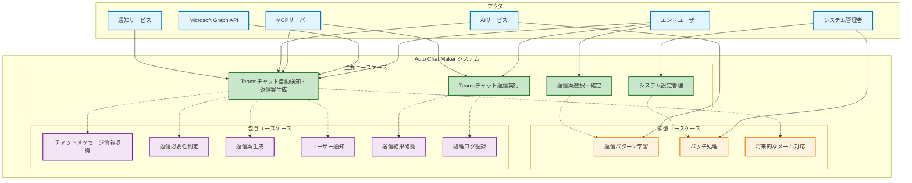

# ユースケース図

Auto Chat Makerシステムのユースケース図です。

## 概要

この図は、Auto Chat Makerシステムの主要な機能とアクターの関係を示しています。

## ユースケース図

## 説明

### アクター

- **エンドユーザー**: システムの主要利用者
- **システム管理者**: システム設定の管理者
- **Microsoft Graph API**: Teamsチャットとの連携
- **MCPサーバー**: チャット送信の実行
- **AIサービス**: 返信案生成と学習
- **通知サービス**: ユーザーへの通知

### 主要ユースケース

1. **Teamsチャット自動検知・返信案生成**: 新着メッセージの自動検知とAIによる返信案生成
2. **返信案選択・確定**: ユーザーによる返信案の選択と編集
3. **Teamsチャット返信実行**: 確定された返信の送信
4. **システム設定管理**: 管理者によるシステム設定の管理

### 拡張ユースケース

- **返信パターン学習**: AIによる返信パターンの学習
- **バッチ処理**: 定期的な処理の実行
- **将来的なメール対応**: Outlookメール対応（拡張予定）

### 包含ユースケース

- **チャットメッセージ情報取得**: Teamsチャットからのメッセージ情報取得
- **返信必要性判定**: AIによる返信の必要性判定
- **返信案生成**: AIによる返信案の生成
- **ユーザー通知**: ユーザーへの通知送信
- **送信結果確認**: 送信結果の確認
- **処理ログ記録**: 処理ログの記録

### 関係性の説明

- **実線矢印**: アクターとユースケースの直接的な関係
- **点線矢印（包含）**: ユースケース間の包含関係（<<include>>）
- **点線矢印（拡張）**: ユースケース間の拡張関係（<<extend>>）

詳細な開発ルールについては [開発者ガイド](../developer-guide/README.md) を参照してください。
