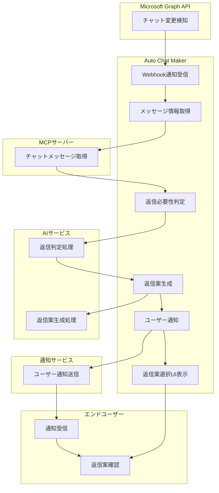
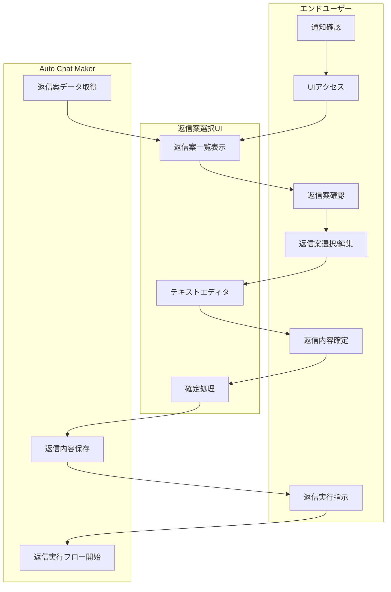
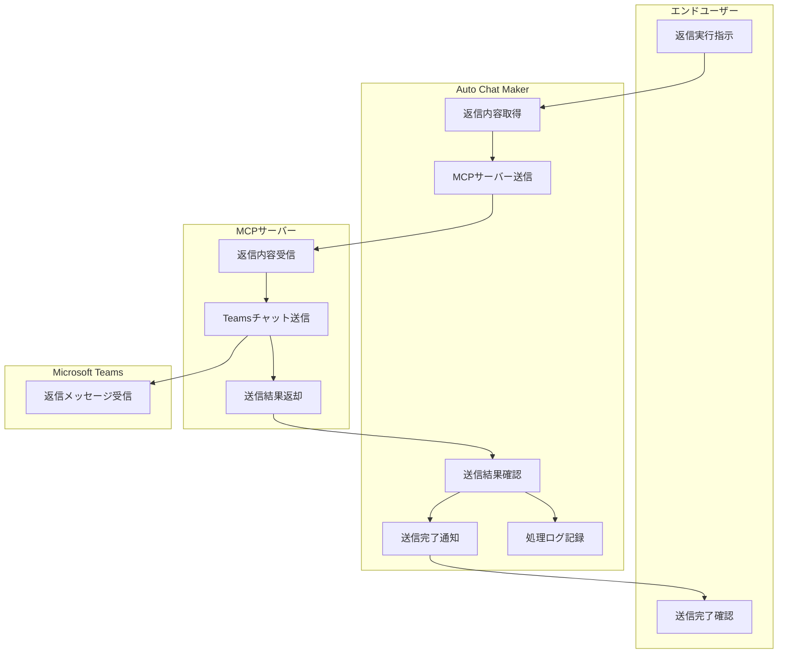
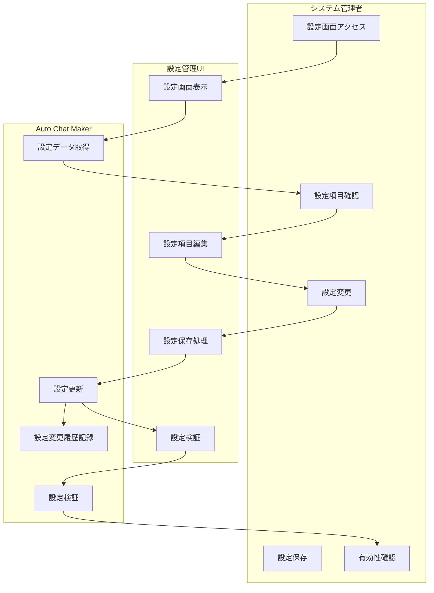
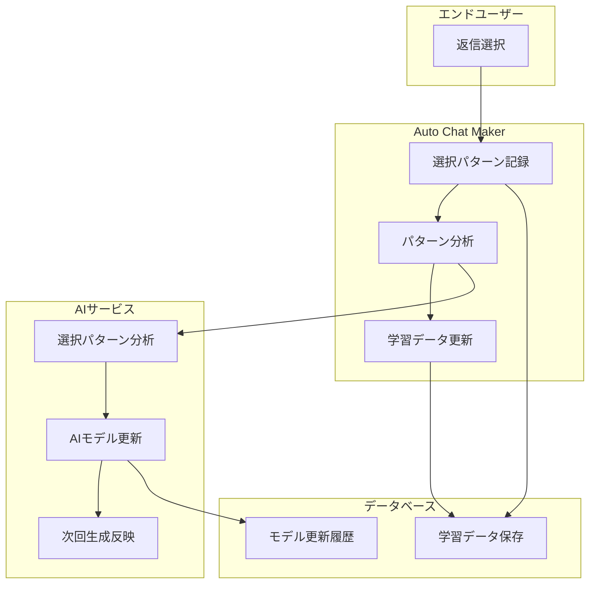
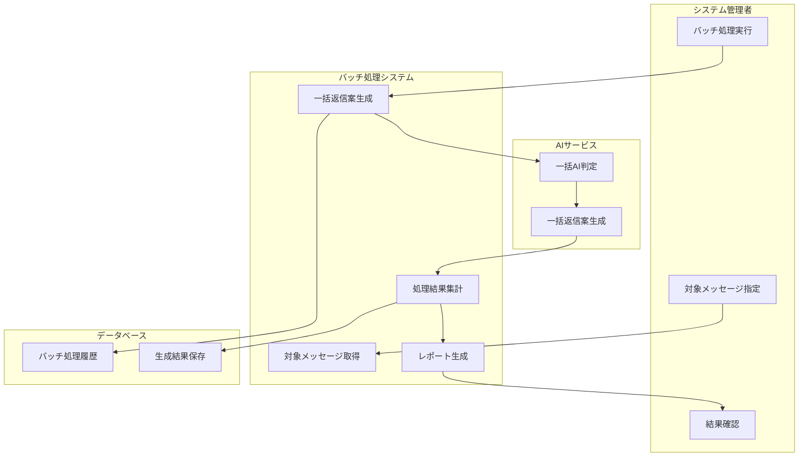
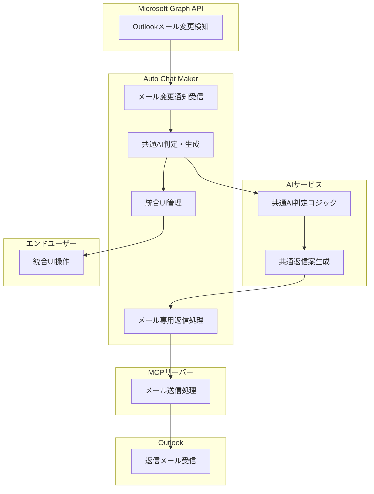

# ユースケース

## 1. 概要

Auto Chat Makerシステムのユースケース定義書です。Microsoft Teamsチャットの自動検知からAIによる返信案生成、ユーザー選択による返信実行までの一連のフローを定義します。システムは拡張性を重視し、将来的なOutlookメール対応も容易に追加できる設計となっています。

## 2. アクター定義

### 2.1 プライマリアクター

- **エンドユーザー**: Teamsチャットの送受信を行うビジネスユーザー
- **システム管理者**: システムの設定・管理を行う管理者

### 2.2 セカンダリアクター

- **Microsoft Graph API**: Teamsチャットの変更通知を提供
- **MCPサーバー**: チャットメッセージの取得・送信を実行
- **AIサービス**: 返信判断・案生成を実行
- **通知サービス**: ユーザーへの通知を送信

## 3. 主要ユースケース

### 3.1 UC-001: Teamsチャット自動検知・返信案生成

#### **概要**
新着チャットメッセージを自動検知し、AIによる返信案を生成する

#### **アクター**
エンドユーザー、Microsoft Graph API、AIサービス

#### **前提条件**:
- システムが正常に動作している
- ユーザーがMicrosoft 365アカウントにログインしている
- Webhookサブスクリプションが有効である

#### **基本フロー**:
1. Microsoft Graph APIがTeamsチャットの変更を検知
2. Webhook経由でバックエンドに通知が送信される
3. システムがMCPサーバー経由でチャットメッセージ情報を取得
4. AIサービスが返信必要性を判定
5. 返信が必要と判断された場合、3件の返信案を生成
6. ユーザーに通知を送信
7. 返信案選択UIを表示

#### **代替フロー**:
- **A1**: 返信が不要と判断された場合
  - ステップ5で処理を終了し、ユーザーに通知しない
- **A2**: チャットメッセージ情報の取得に失敗した場合
  - エラーログを記録し、処理を終了
- **A3**: AIサービスが利用できない場合
  - フォールバック処理として、定型返信案を生成

#### **例外処理**:
- **E1**: Webhookサブスクリプションが期限切れの場合
  - 自動的にサブスクリプションを更新
- **E2**: チャットメッセージが大量に届いた場合
  - 優先度に基づいて処理順序を決定

#### **事後条件**:
- 返信案が生成され、ユーザーに通知される
- 処理ログが記録される

### 3.2 UC-002: 返信案選択・確定

#### **概要**: ユーザーが生成された返信案を選択・編集し、確定する

#### **アクター**: エンドユーザー

#### **前提条件**:
- 返信案が生成されている
- ユーザーが通知を受け取っている

#### **基本フロー**:
1. ユーザーが通知を確認
2. 返信案選択UIにアクセス
3. 生成された返信案を確認
4. 返信案を選択または編集
5. 返信内容を確定
6. システムに返信実行を指示

#### **代替フロー**:
- **A1**: ユーザーが返信案を編集する場合
  - ステップ4でテキストエディタを表示
  - ユーザーが内容を編集後、確定
- **A2**: ユーザーが返信をキャンセルする場合
  - 処理を終了し、UIを閉じる
- **A3**: ユーザーが新しい返信案を要求する場合
  - AIサービスに再生成を依頼

#### **例外処理**:
- **E1**: 返信案の選択に時間がかかった場合
  - セッションタイムアウトを設定
- **E2**: ネットワークエラーが発生した場合
  - エラーメッセージを表示し、再試行オプションを提供

#### **事後条件**:
- 返信内容が確定される
- 返信実行フローが開始される

### 3.3 UC-003: Teamsチャット返信実行

#### **概要**: 確定された返信内容をMCP経由でTeamsチャットに送信する

#### **アクター**: エンドユーザー、MCPサーバー

#### **前提条件**:
- 返信内容が確定されている
- MCPサーバーが利用可能である

#### **基本フロー**:
1. 確定された返信内容をMCPサーバーに送信
2. MCPサーバーがTeamsチャットに返信メッセージを送信
3. 送信結果を確認
4. ユーザーに送信完了を通知
5. 処理ログを記録

#### **代替フロー**:
- **A1**: 送信に失敗した場合
  - エラーメッセージを表示
  - 再送信オプションを提供
- **A2**: 添付ファイルがある場合
  - 添付ファイルも含めて送信

#### **例外処理**:
- **E1**: MCPサーバーが利用できない場合
  - エラーログを記録し、後で再試行
- **E2**: 送信制限に達した場合
  - 制限解除まで待機

#### **事後条件**:
- 返信メッセージが正常に送信される
- 送信履歴が記録される

### 3.4 UC-004: システム設定管理

#### **概要**: システム管理者がシステム設定を管理する

#### **アクター**: システム管理者

#### **前提条件**:
- 管理者権限を持つアカウントでログインしている

#### **基本フロー**:
1. 管理者が設定画面にアクセス
2. 各種設定項目を確認・変更
3. 設定変更を保存
4. 設定の有効性を確認

#### **代替フロー**:
- **A1**: 設定に問題がある場合
  - エラーメッセージを表示
  - 修正を促す

#### **例外処理**:
- **E1**: 設定変更が失敗した場合
  - ロールバック処理を実行

#### **事後条件**:
- 設定が正常に更新される
- 設定変更履歴が記録される

## 4. 拡張ユースケース

### 4.1 UC-005: 返信パターン学習

#### **概要**: ユーザーの返信選択パターンを学習し、精度を向上させる

#### **アクター**: エンドユーザー、AIサービス

#### **基本フロー**:
1. ユーザーの返信選択を記録
2. 選択パターンを分析
3. AIモデルを更新
4. 次回の返信案生成に反映

### 4.2 UC-006: バッチ処理

#### **概要**: 大量のチャットメッセージに対して一括で返信案を生成する

#### **アクター**: システム管理者

#### **基本フロー**:
1. 対象チャットメッセージを指定
2. バッチ処理を実行
3. 一括で返信案を生成
4. 結果をレポート形式で出力

### 4.3 UC-007: 将来的なメール対応（拡張予定）

#### **概要**: Outlookメールに対しても同様の自動返信機能を提供する

#### **アクター**: エンドユーザー、Microsoft Graph API、MCPサーバー

#### **基本フロー**:
1. Microsoft Graph APIがOutlookメールの変更を検知
2. 共通のAI判定・生成ロジックを使用
3. メール専用の返信処理を実行
4. 統合UIでチャットとメールを管理

## 5. 非機能要件

### 5.1 パフォーマンス要件
- チャットメッセージ検知から返信案生成まで5分以内
- 同時処理可能ユーザー数: 100人以上

### 5.2 可用性要件
- システム稼働率: 99.9%以上
- メンテナンス時間: 月1回、2時間以内

### 5.3 セキュリティ要件
- チャットメッセージ内容の暗号化
- アクセス制御の実装
- 監査ログの記録

### 5.4 拡張性要件
- プラグイン形式での新機能追加
- 設定による機能の有効/無効切り替え
- 将来的なメール対応時の開発効率

## 6. 更新履歴

- 初版作成: 2024年12月
- Teams対応化: 2024年12月 - Teamsチャットベースに変更、拡張ユースケースを追加
- MkDocs対応: 2024年12月 - ボールドタイトルに####を追加して箇条書き表示を改善
- フロー図追加: 2024年12月 - 各ユースケースにMermaidスイムレーンフロー図を追加
- 最終更新: 2024年12月
- 更新者: 開発チーム
